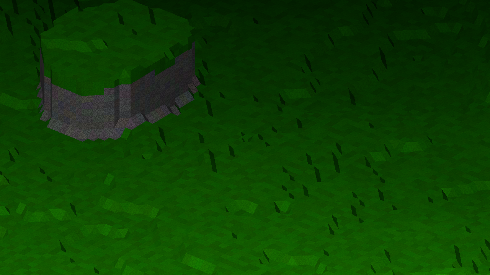
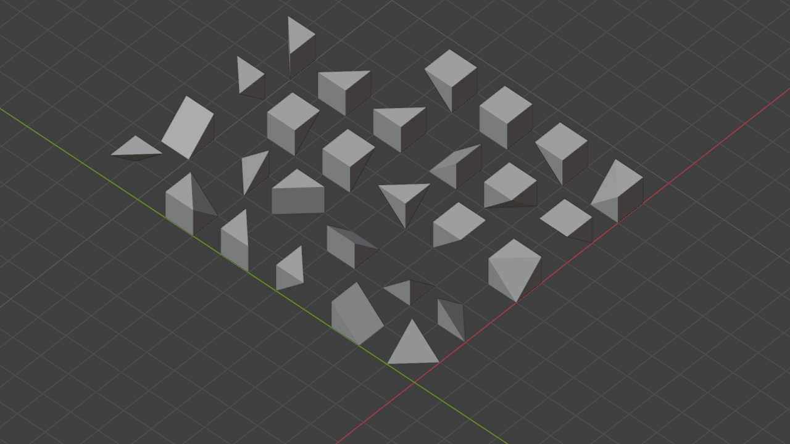
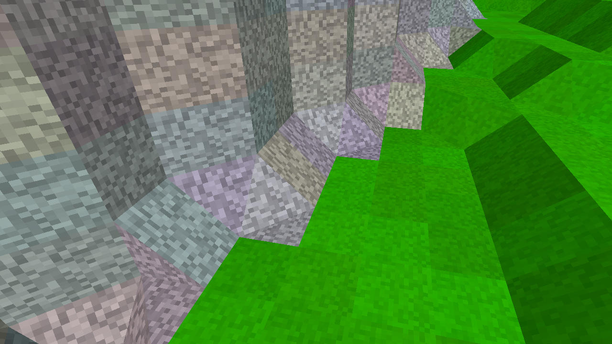
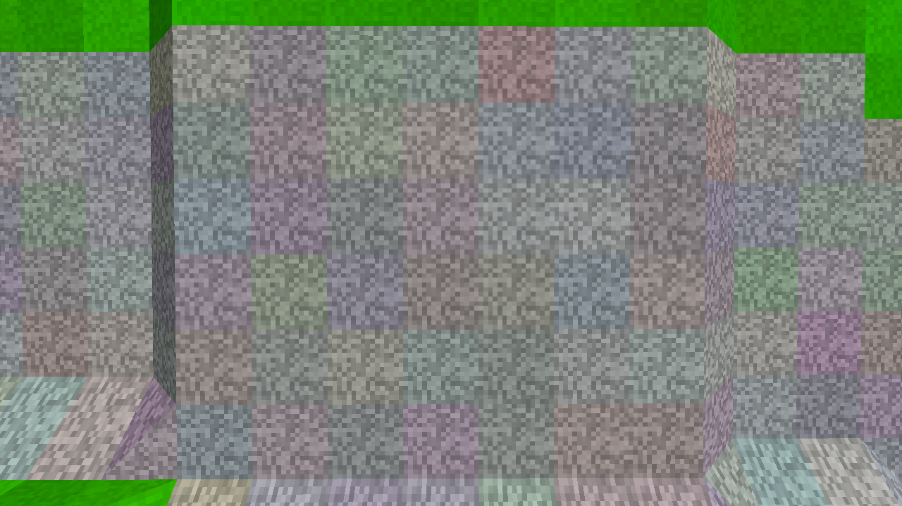
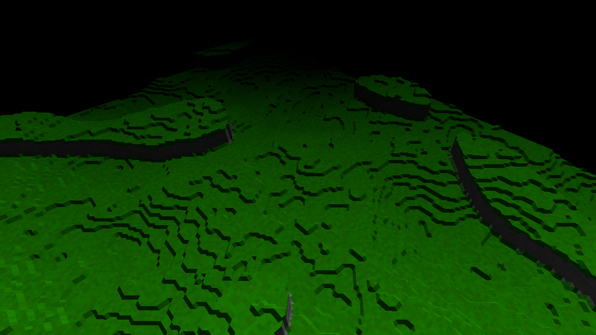

# Smooth Blocky Terrain

Smooth voxel terrain using VoxelMesherBlocky.

Made with [Voxel Tools for Godot](https://github.com/Zylann/godot_voxel).

# Features

- Voxel shapes

- Voxel types

- Fields and hills

- Noise

- Fog/depth

# Controls

- W, A, S, D - Movement
- Q, E - Rotation
- F11 - Fullscreen